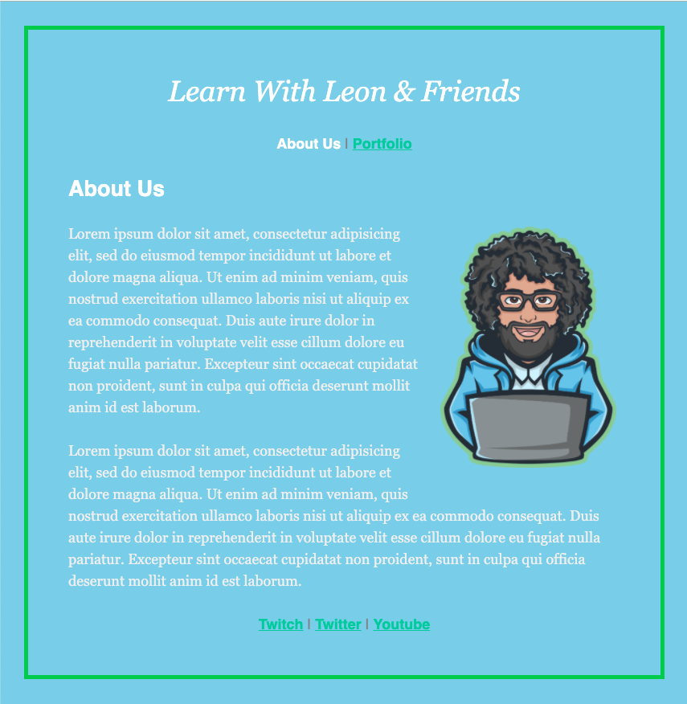
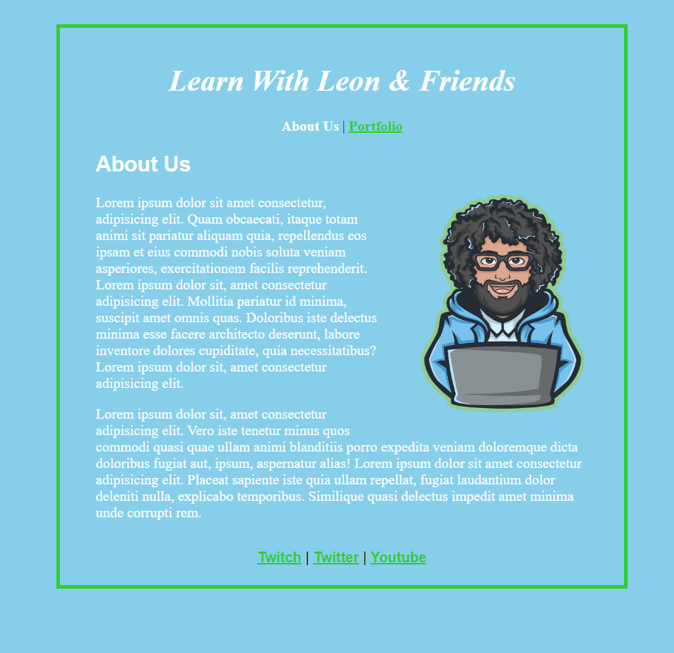

# 100Devs Class 04 HW



## Table of contents

- [Overview](#overview)
  - [The challenge](#the-challenge)
  - [Screenshot](#screenshot)
- [My process](#my-process)
  - [Built with](#built-with)
  - [What I learned](#what-i-learned)
  - [Continued development](#continued-development)
  - [Useful resources](#useful-resources)
- [Author](#author)
- [Acknowledgments](#acknowledgments)

## Overview

Duplicate a webpage based on the reference picture provided using HTML and CSS.

### The challenge

- Using HTML and CSS, create a replication of the reference picture.

### Screenshot



## My process

Looked at the reference picture provided and determined what elements were needed. I built out the HTML based on what elements I thought were in use such as a H1, footer, span, paragraphs, etc. Once the HTML was fully built out, I focused on going back through the HTML to determine if certain elements need classes and/or IDs. Afterwards, I turned my attention to the CSS portion. Although, I am not comformtable with positioning portion of CSS, I did a good job with the placement of the overall project based on the image provided.

### Built with

- Semantic HTML5 markup
- CSS custom properties

### What I learned

- CSS Basics
- Usage of specificity
- CSS Selections

I particularly proud of the position of the image. It's simple, but was done without the usage of the MDN or any reference other than eyeing the picture given to us.

```css
.img {
  float: right;
  height: 285px;
  width: 210px;
  margin: 30px 60px 50px;
}
```

### Continued development

Things I will continue to focus on:

- CSS positions
- CSS flexbox
- JavaScript

### Useful resources

- [MDN](https://developer.mozilla.org/en-US/) - Give explanations and examples. Great resource for all.
- [Class 04](https://www.youtube.com/watch?v=Q1Obtn29twk&list=PLBf-QcbaigsJysJ-KFZvLGJvvW-3sfk1S&index=5) - First class for CSS basics.

## Author

- GitHub - [AvionShea](https://github.com/AvionShea)
- LinkedIn - [Avion Cobb](https://www.linkedin.com/in/avion-cobb/)
- Twitter - [@Avion_Cobb](https://www.twitter.com/Avion_Cobb)
- Frontend Mentor - [@AvionShea](https://www.frontendmentor.io/profile/AvionShea)
- Website - [Avion Cobb](https://avionshea.github.io/)

## Acknowledgments

- [#100Devs](https://leonnoel.com/100devs/) - Information on #100Devs and Leon Noel
